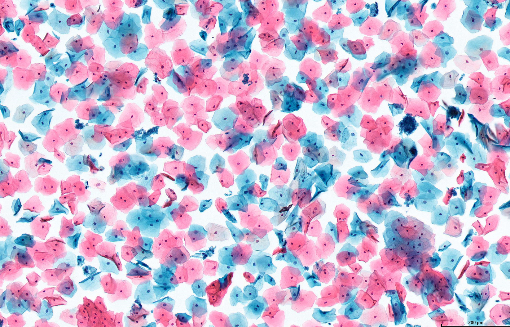

# Сегментация клеток и клеточных ядер на цитологических изображениях
Врачи "Диагностического центра лабораторных исследований департамента здравоохранения города Москвы" предоставили для данной задачи результаты цитологических исследований мазков из цервикального канала и шейки матки (ПАП-тест).  
По данным изображениям клеточных структур требовалось реализовать семантическую (semantic) и инстанс (instance) сегментации клеток и клеточных ядер плоского эпителия.

  
  

---
В процессе решения задачи семантической сегментации были реализованы классические методы, такие как пороговая сегментция, сегментация методом водоразделов, алгоритмом k-means и прочие. Для задачи инстанс-сегментации использовался подход с помошью водоразделов, а также c помощью нейронной сети StarDist, которая имеет широкое применение в области сегментации цитологических изображений. Разметка изображений для задачи обучения сети осуществлялась в приложении QuPath.
 
Полный репозиторий со всеми фотографиями, размеченными масками и обученными моделями можно скачать по ссылке:

 
 

 
 > Решение данного проекта представлено в формате четырех документов:
>1. Код сегментации часть 1 - [segmentation_part_1.ipynb](https://github.com/Koldim2001/Segmentation_cells-nuclei/blob/main/segmentation_part_1.ipynb)
>2. Код сегментации часть 2 - [segmentation_part_2.ipynb](https://github.com/Koldim2001/Segmentation_cells-nuclei/blob/main/segmentation_part_2.ipynb)
>3. Код для обучения нейронной сети - [training.ipynb](https://github.com/Koldim2001/Segmentation_cells-nuclei/blob/main/training.ipynb)
>4. Текстовый отчет в формате pdf - [report.pdf](https://github.com/Koldim2001/Emotion_classifier/blob/main/emotion_class_multy.ipynb)
